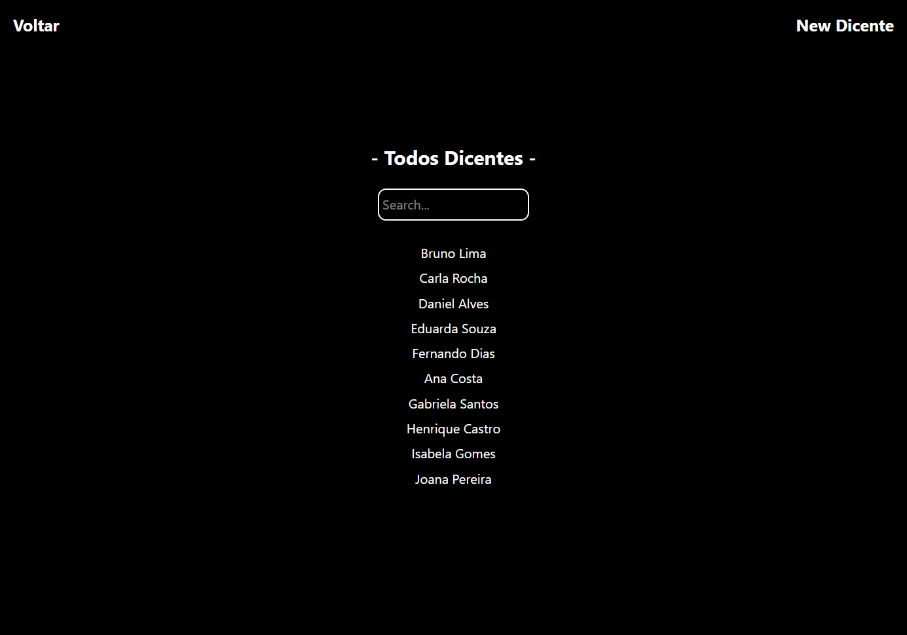

[AXIOS_BADGE]: https://img.shields.io/badge/axios-1.9.0-7c12b7?style=for-the-badge&logo=axios
[TYPESCRIPT__BADGE]: https://img.shields.io/badge/typescript-D4FAFF?style=for-the-badge&logo=typescript
[ZOD_BADGE]: https://img.shields.io/badge/axios-3.25.76-457CD4?style=for-the-badge&logo=zod
[REACT__BADGE]: https://img.shields.io/badge/React-005CFE?style=for-the-badge&logo=react
[PROJECT__BADGE]: https://img.shields.io/badge/📱Visit_this_project-000?style=for-the-badge&logo=project
[PROJECT__URL]: https://crud-ifma-front-end.vercel.app/
[NODE_BADGE]: https://img.shields.io/badge/node.js-20.16.0-43853D?style=for-the-badge&logo=node.js
[shadcn-ui_BADGE]: https://img.shields.io/badge/shadcn--ui-latest-111827?style=for-the-badge
[TailwindCSS_BADGE]: https://img.shields.io/badge/Tailwind_CSS-4.1.7-38B2AC?style=for-the-badge&logo=tailwindcss
[Vite_BADGE]: https://img.shields.io/badge/Vite-6.3.5-646CFF?style=for-the-badge&logo=vite

<h1 align="center" style="font-weight: bold;">CRUD-IFMA-FRONT-END</h1>

![react][REACT__BADGE]
![axios][AXIOS_BADGE]
![typescript][TYPESCRIPT__BADGE]
![node][NODE_BADGE]
![zod][ZOD_BADGE]
![shadcn-ui][shadcn-ui_BADGE]
![tailwindcss][TailwindCSS_BADGE]
![vite][Vite_BADGE]

<details open="open">
<summary>Table of Contents</summary>
 
- [📌 About](#started)
- [🚀 Getting started](#started)
  - [Prerequisites](#prerequisites)
  - [Cloning](#cloning)
  - [Starting](#starting)
- [📍 Application Routes](#routes)
- [🤝 Collaborators](#colab)
  
</details>

<div style="display: flex; justify-content: center; gap: 20px;">
  <p>
      
  </p>
  <p>
      
  </p>
  <p>
      
  </p>
</div>
<div style="display: flex; justify-content: center; gap: 20px;">
  <p>
      
  </p>
  <p>
      
  </p>
  <p>
      
  </p>
  <p>
      
  </p>
</div>

<h2 id="started">📌 About</h2>

Um simplese CRUD feito em react para estudar algumas tecnologias e funcionalidades do react, como useMemo.

[![project][PROJECT__BADGE]][PROJECT__URL]

<h2 id="started">🚀 Getting started</h2>

<h3>Prerequisites</h3>

- [Node](https://nodejs.org/pt/download)
- [Git](https://git-scm.com/downloads)
- [Visual Studio Code](https://code.visualstudio.com/docs/?dv=win64user)

<h3>Cloning</h3>

```bash
git clone https://github.com/Coe-Everton/CRUD-IFMA-FRONT-END.git
```

<h3>Starting</h3>

```bash
cd CRUD-IFMA-FRONT-END
npm run dev "or" npm start
```

<h2 id="routes">📍 Application Routes</h2>

| route                | description                                         |
| -------------------- | --------------------------------------------------- |
| <kbd>/</kbd>         | Home, aqui se encontra as tabelas no banco de dados |
| <kbd>/cursos</kbd>   | Demosntrar os cursos cadastrados                    |
| <kbd>/dicentes</kbd> | Demosntrar os dicentes cadastrados                  |
| <kbd>/docentes</kbd> | Demosntrar os docentes cadastrados                  |

<h2 id="colab">🤝 Collaborators</h2>

<table>
  <tr align="center">
    <a href="#">
      <br>
      <sub>
        <b>Everton Caldeira Oliveira</b>
      </sub>
    </a>
  </tr>
</table>
